# My Dinner Pal Frontend

This is the production frontend application for mydinnerpal.com. It's a multipage web app made with React.js and is deployed on Github Pages and includes integrations with the Stripe API. The purpose of this app is to serve as an account manager and landing page for customers and users (beta testers) where customers can purchase subscriptions to the paid My Dinner Pal email lists and users can manage their account information and subscription to the the email list. 

**Full app deployed here:** https://mydinnerpal.com/

## Screenshots / Highlighted Features

*Website Hero*

*Log In Popup*

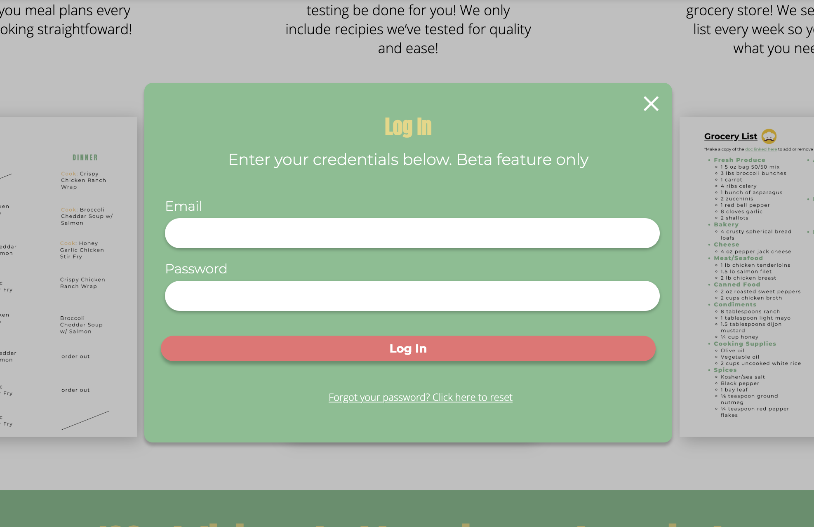

*Password Reset Email*

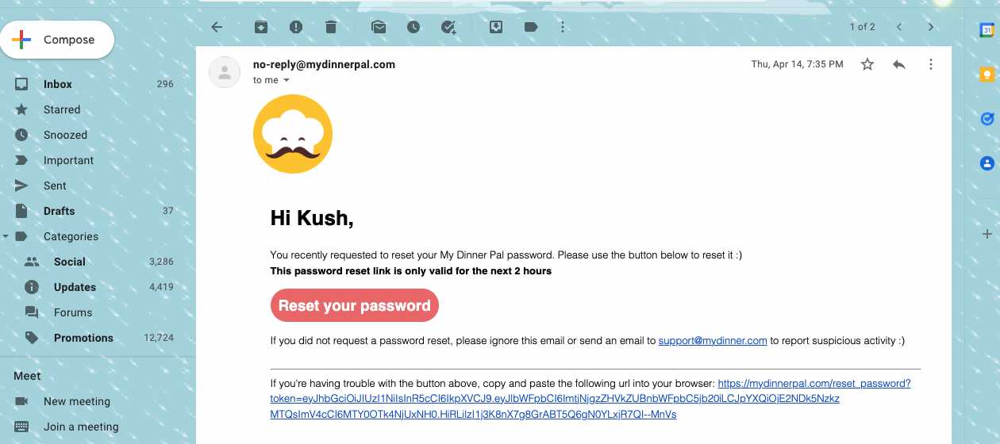

*Toggle Annual/Monthly Billing*

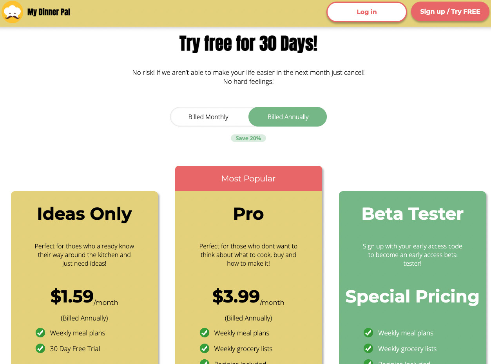
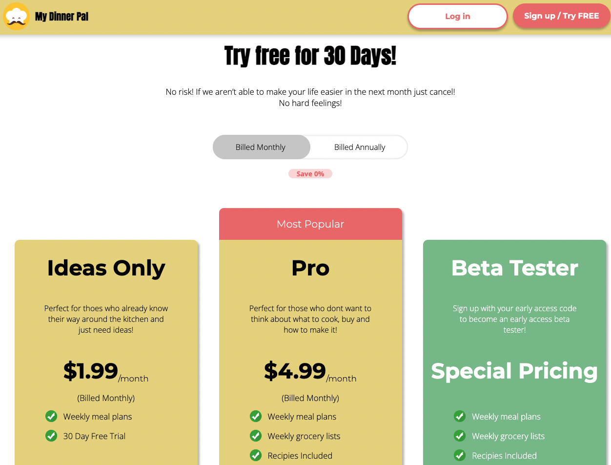

*Purchase Plan Popup*

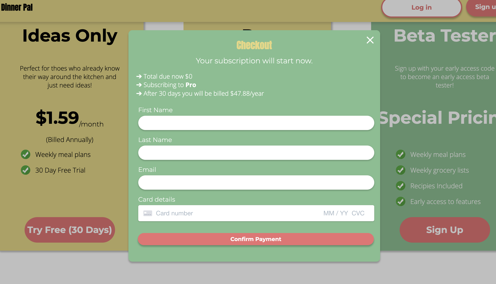

*Signup Popup*

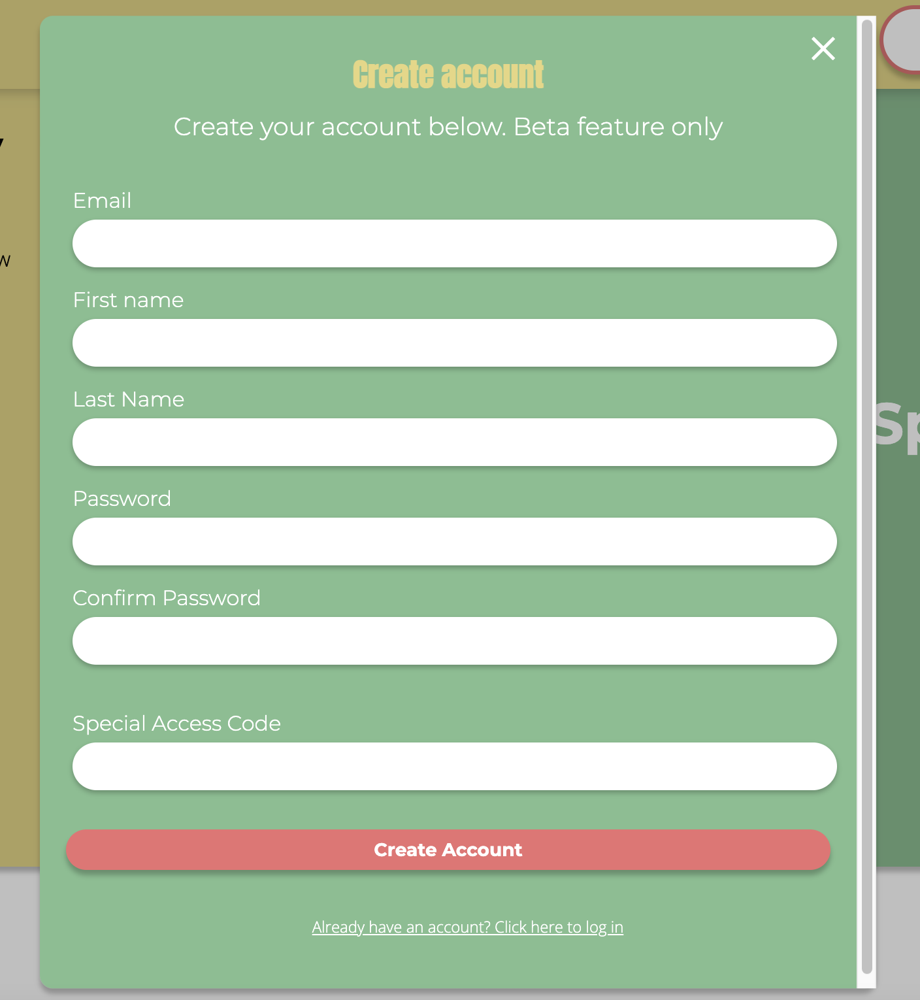

*Signup Success Popup*

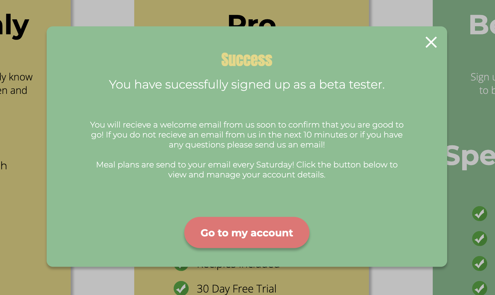

*Account Home*

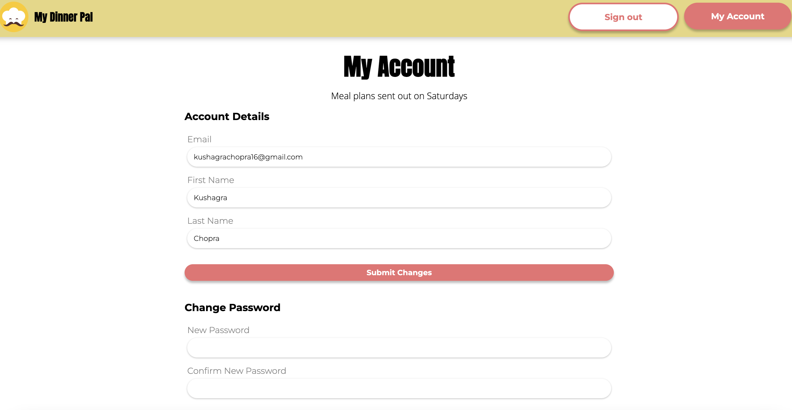

*Account Actions*

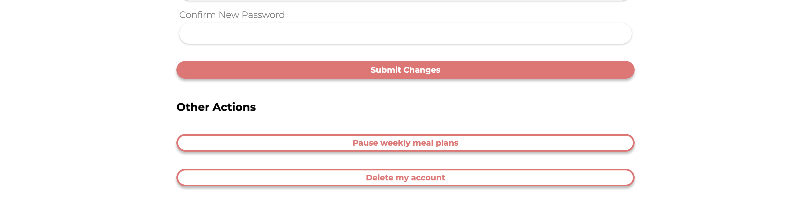

*Delete Account*

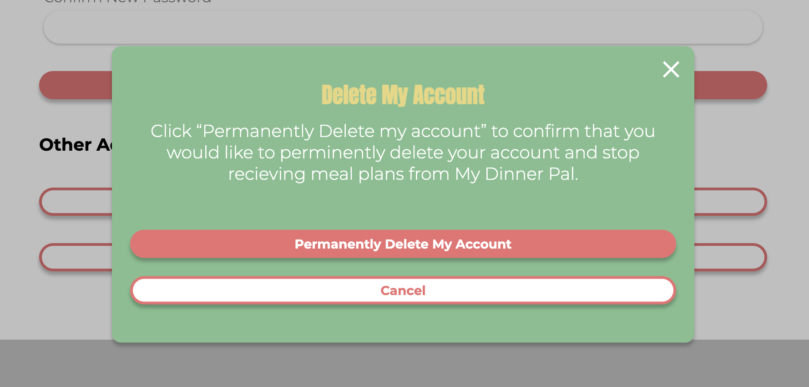

*Pause Meal Plans*

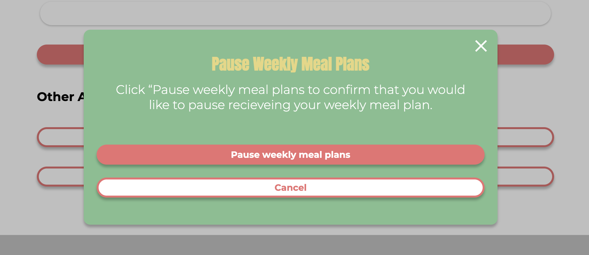

